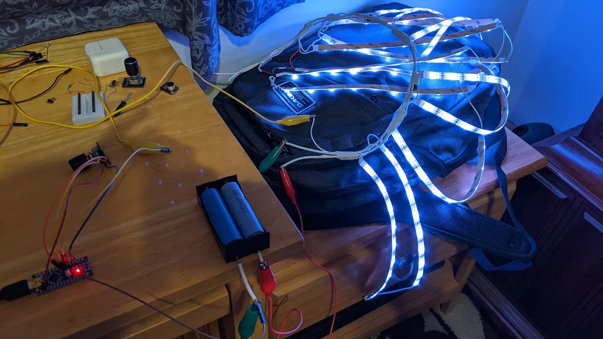
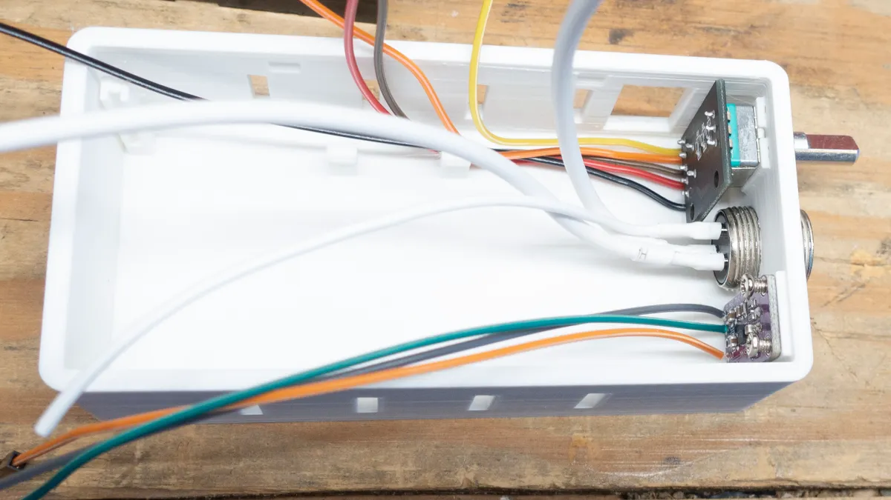
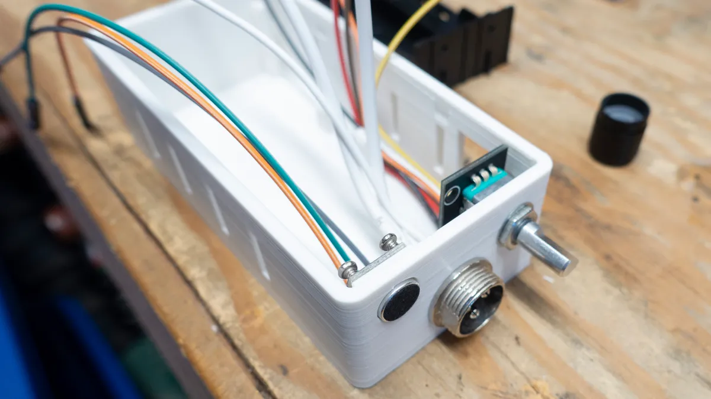
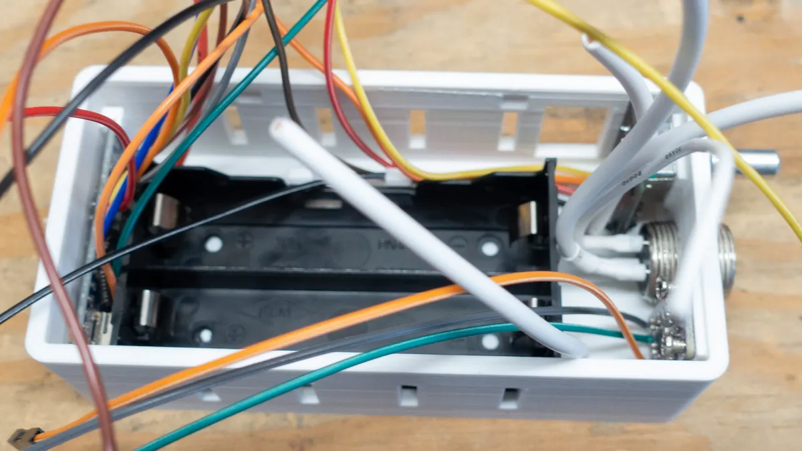
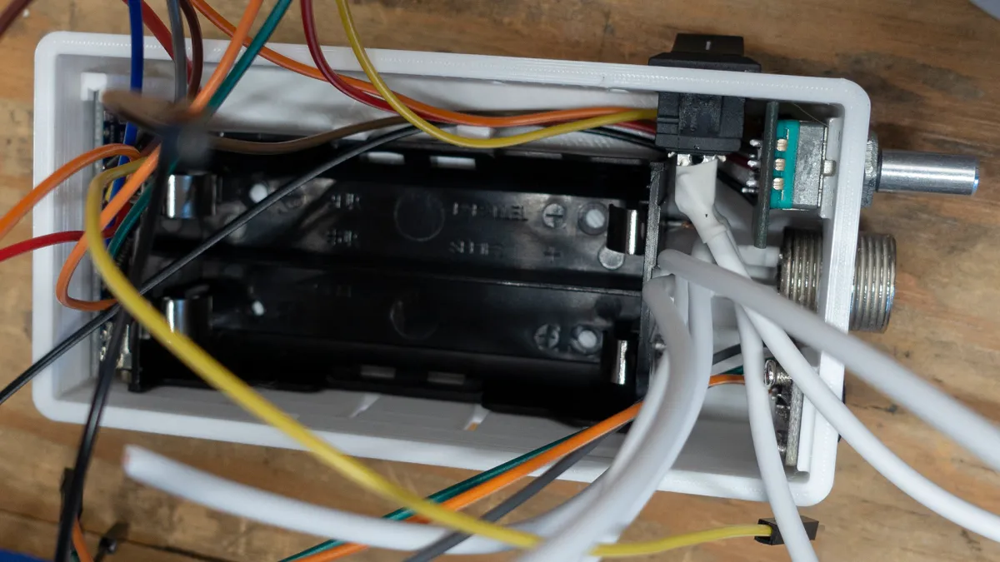

# Smart Dress
A dress that lights up in neat ways

While finishing up the Halloween mobile, my daughter and I thought it would be neat to make a light-up dress for wearing around the holidays. The first thought was something that would pick up the noise or music in the room and display it which seems to be called an audio spectrum analyzer. The second thought was that it could also just light up white. Then we thought brightness control would be nice as would a mode where her name could cycle around the dress. Then later we threw on a picture/sprite mode and a candy cane mode. It should go onto a white skirt/dress base and there should be a control box to hold the batteries, electronics and to allow control and a power switch.

First we needed a matrix of lights to put around the dress. We figured that a ws2812b strip in the least dense configuration might be a good balance of coverage and power consumption. They come in a reel of 150 lights and a quick measure of the length of the skirt pattern that we had indicated that a down length of nine lights would be about right. Then we could get 16 strips out of the reel of 150 for a total of 144 lights. I thought about more, but the spacing seemed OK given the strips had some room between each light and I figured the horizontal and vertical spacing should probably be roughly equal. After the project was complete, I found some testing that said you could probably drive the whole 150 strip from just powering each end. However, since I didn’t know this yet and was concerned about getting consistent power to the whole dress, I decided to run positive and negative 16GA lines the length of the dress with 20GA lines patched in every other column. Since I decided to use 2x 18650 LI batteries in series as the power source I would also need a step-down buck converter for each set of columns (eight of those total.) Every time I wired up a pair of them and the buck converter serving them, I would test it out. At the end of this process, the test looked like this:

At this point, things were in a spot where we could light up any given pixel and it was working with the FastLED library. Now we wanted to get the microphone to work and it turned out that the one we had from an Arduino clone kit would only trigger and not really be a microphone. So I got two more that were more normal mics with built-in amps and went with the one that was auto-adjusting, figuring that would save an external control for a gain knob. [This one](https://www.amazon.com/gp/product/B07D551Y94). After the mic was wired up and producing continuous values, it was time to try to get a waveform from the environment. I had absolutely no idea how to do this, but some searching indicated two possible paths; buy a kit with built-in electronics to do it or run it through a Fast Fourier Transform from a library. The kit would add some more things that would have to fit in the control box and I didn’t want that, so why not try the FFT library first and see if the Arduino is fast enough. It took a couple tries, but if you use an FFT with a length of 32 (needs to be a power of two) you end up with 16 frequency bins (the latter half ends up as zero values), which happens to be our number of columns. You need to sample from the mic often to get high sound frequency. After reading that human hearing was a 20Khz I was targeting that. However after looking at the Arduino specs and downloading an Android frequency generator, I decided to abandon the very high end and sample 10,000 times and the FFT loop seemed to slice this into a 10th of a second. In looking back to calculate exactly which frequencies are picked up, I don’t know. Empirical testing seems to say that 100hz to 5khz seem to show up correctly at the low and high end of the lights, so it turned out OK. Also, it seems to keep up with about a tenth of a second updates, which looks nice. Pretty impressive for such an inexpensive part.

So two of the modes were working and we moved to add the name scrolling across in purple. Since we did this as a static set of bits, my daughter started helping to set everything to the correct shape. Once that worked, we moved to color arrays and she made the pictures that she wanted to show; an ornament ball, snowman, xmas tree and snowflake. After that worked, we used most of the remaining memory on the candy cane design.
Before being put into the dress and control box, it looked like this:

Now a bunch of stuff needed to go in as tiny a box as possible. I did a few rounds of 3D printed boxes and optimized to about what is seen below. It was actually too small to get everything wired and I had to add a centimeter to make it possible to work with. I also took that rework as an opportunity to put a couple loops on the top as I hadn’t thought how the control box would stay with the skirt and on my daughter’s waist. You can get the idea with these pictures although this was before the room and tie loops were added:

Last was to get it into a skirt. We used a plain white bottom layer to keep the LED matrix off of the person. Then the LED matrix and a layer of three-quarter inch seat batting. The batting acted as a diffuser for the LEDs so they would not be pure point sources of light while still letting most of the light through. Then a top layer the same as the bottom. My wife put ties in for the top of the matrix (in addition to sewing up the whole skirt) so it would stay in place while still being removable if needed. It ended up helping a lot to pin the bottom of the matrix onto the seat batting to keep the LEDs against it at both the top and bottom. Finally, some white ribbon went through the box loops and could be tied around the waist to keep it in place.

## Things Learned
I got a little better at soldering. From bad to less bad, but this project was more soldering for me than all that had come before it. Nicer solder also seems to make a big difference in how easy it is to hook things up. I ran out of the small amount I had from many years ago. The first replacement spool was so hard to use by comparison, I tried again and got something much easier to work with.

LED strip lights will act strangely in many circumstances. If you forget a ground connection, they go crazy. If your batteries are not supplying enough voltage, they go crazy before they go dim and stop. If things are really clean (when I was USB connected to the laptop) you don’t need a resistor to smooth out the signal line waveform, but when less clean (no laptop ground) I did end up needing the dropping resistor and without it, the lights would go semi-crazy. Touching anything in this state would smooth things back to working. Very weird to me, but luckily this seems to be common knowledge to some contributors to Arduino forums and adding the resistor got everything solid.

Everything worked, but it would have been great to get everything done with less bulk and parts. First, I used the water resistant strip lights, but that turned out to be a mistake as the silicon covering had to be cut back and peeled off in 30 places to connect the strips up (a total pain.) It also weighed twice as much as the type without it and was not going to be water resistant at the end of the day anyway. Next I could have used a pouch battery or two instead of the 18650s with their holder. This would have given the same amount of power in a smaller area. Then, I could have used half the number of step down (or up) buck converters and saved solder points, time and number of parts. It is currently outside my knowledge to design a circuit board, but it could really help in a case like this where installing several separate boards and getting them wired was a pretty big pain and used a bunch of space. I would have to at least spend some time thinking about a redesign of the box and layout. The Arduino code and OpenSCAD designs are in the repo